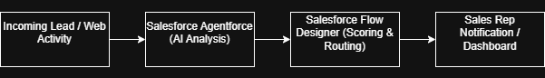

# AI-Powered Lead Generation System

An advanced Salesforce CRM solution integrated with **Agentforce** and automated backend flows to optimize lead ingestion, scoring, and distribution. This system minimizes manual intervention, ensures high-quality data handling, and accelerates the sales pipeline.

---

## Key Features

*   **Agentforce AI Assistant:** Automatically interacts with incoming prospects, answers queries, and collects missing lead parameters.
*   **AI Lead Scoring:** Evaluates lead intent and engagement data to automatically assign an actionable score.
*   **Automated Routing & Assignment:** Standard and custom Salesforce Flows dynamically assign hot leads to the appropriate sales tiers.
*   **Data Migration & Mapping:** Robust schema layout ensuring clean imports and minimal duplication during data ingestion.
*   **User Adoption Framework:** Comprehensive training and change management documentation to ensure seamless team onboarding.

---

## Tech Stack & Configurations

*   **Platform:** Salesforce CRM (Lightning Experience)
*   **AI Capability:** Salesforce Agentforce (Einstein Copilot / AI Agents)
*   **Automation:** Salesforce Flow Builder
*   **Data Management:** Data Loader / Import Wizard mapping

---
## 🏗️ System Architecture

Below is the system architecture diagram outlining the data flow from lead ingestion through Agentforce processing, Flow automation, and final sales rep notification:

---

## 📂 Project Structure

├── force-app/main/default/
│   ├── bot/                 # Agentforce Agents and Dialog configurations
│   ├── flows/               # Lead prioritization and alert automation Flows
│   ├── objects/             # Custom Lead/Opportunity fields and Data Models
├── Project Documentation.md # Master document outlining system architecture
└── User_Adoption_and_Change_Management.md # Strategy and training guidelines

---

## Installation & Setup Overview

1. Clone this repository to review the system configuration schemas.
2. Review `Project Documentation.md` for specific step-by-step Flow configurations.
3. Refer to the root image files to view data migration mapping schemas and actual UAT testing execution screenshots.
